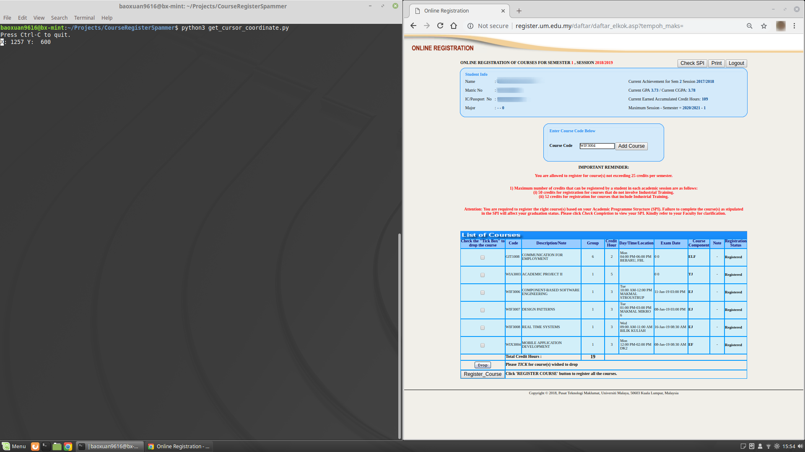
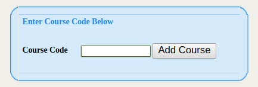
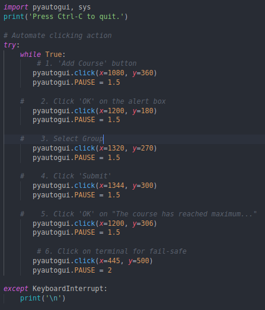

# Setup
Install Python if you haven't done so already.

Open Terminal (or CMD in Windows) and type in the following commands:
    
    `git clone https://github.com/KhooBaoXuan/CourseRegistrationSpammer.git`

    `cd CourseRegistrationSpammer`
    
    `pip3 install setuptools && pip3 install pyautogui`

# How To Use: 
### (A) Get cursor coordinaton
 1. Run the determine_coordinate.py file to get the cursor coordinate location of the designated buttons.

    `python3 get_cursor_coordinate.py`

2. Browse and log into [UM course registration page.](register.um.edu.my/daftar/loginstud.asp)

3. Snap your browser window to one side and the terminal running the program to the other side.

    #### note: resize your browser window to 90% or smaller so that certain button won't overshoot causing the cursor cannot find the button.

3. Key in your desired Course code.

4. Dry run once and jot down the cursor's coordination of all the buttons that needed to click to complete the registration.

5. As a fail-safe, jot down your cursor coordination inside your terminal as the last click. 
    #### note: depends on situation, there will be around 6 clicks including the fail-safe click.

### (B) Edit the code
Using your favorite code editor. Edit 'registerspammer' python file and replace the coordinates that you jotted earlier. Read the comment, make sure you didn't paste the wrong coordinate.

Be patient and profit!

### (C) Stop the program

When the cursor stops at the terminal, quickly press 'Ctrl + C' to halt the program. 